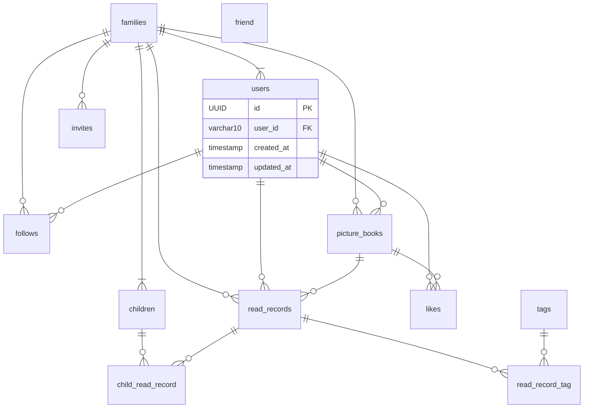

# E-R

```mermaid
    erDiagram
    families ||--|{ users : ""
        families ||--|{ children : ""
        families ||--o{ follows : ""
        families ||--o{ picture_books : ""
        families ||--o{ read_records : ""
        families ||--o{ invites : ""
        users ||--o{ follows : ""
        users ||--o{ likes : ""
        users ||--o{ picture_books : ""
        users ||--o{ read_records : ""
        children ||--o{ child_read_record : ""
        picture_books ||--o{ read_records : ""
        picture_books ||--o{ likes : ""
        read_records ||--o{ child_read_record : ""
        read_records ||--o{ read_record_tag : ""
        tags ||--o{ read_record_tag : ""

        users {
        UUID id PK
        varchar10 user_id FK
        timestamp created_at
        timestamp updated_at
        }
        friend
```