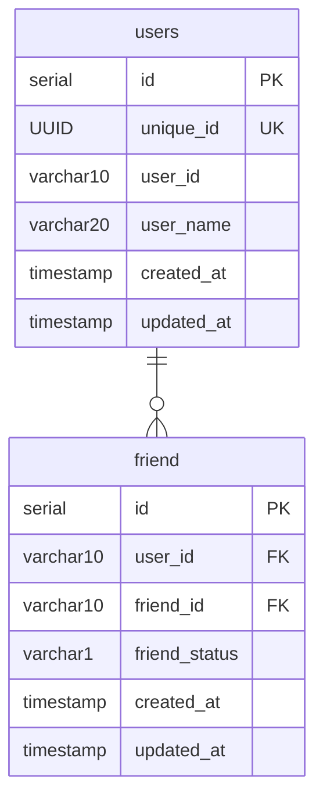

```mermaid
    erDiagram
    users ||--o{ friend : ""

        users {
        serial id PK
        UUID unique_id UK
        varchar10 user_id 
        varchar20 user_name
        timestamp created_at
        timestamp updated_at
        }
        friend {
            serial id PK
            varchar10 user_id FK
            varchar10 friend_id FK
            varchar1 friend_status
            timestamp created_at
            timestamp updated_at
        }
```